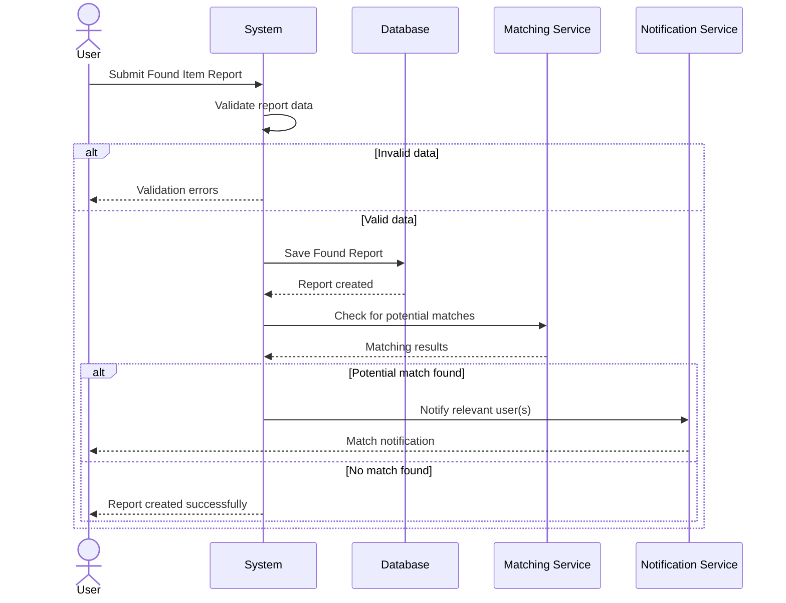
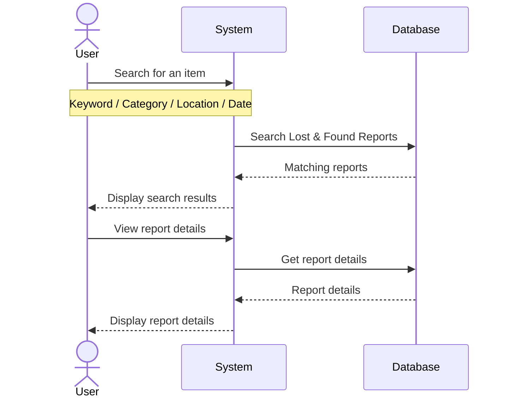
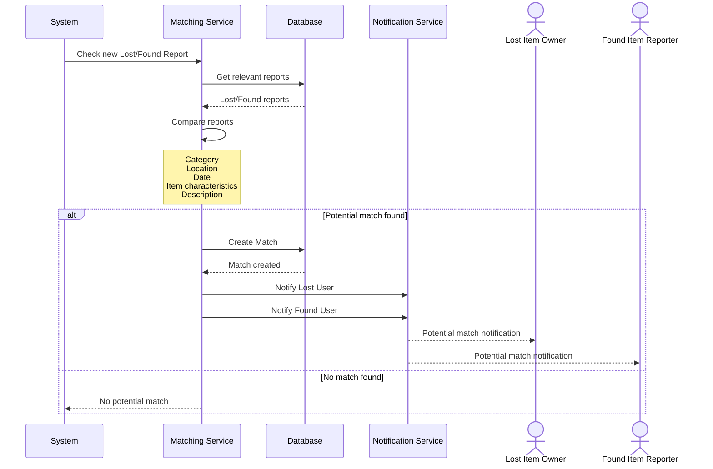
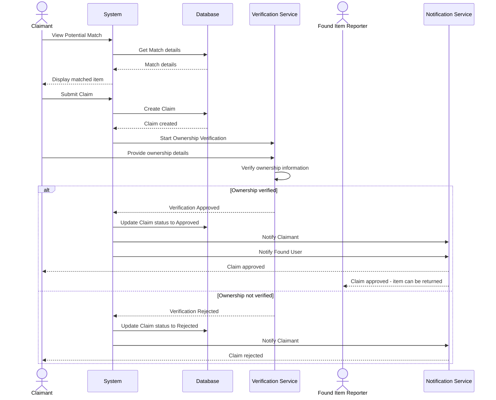
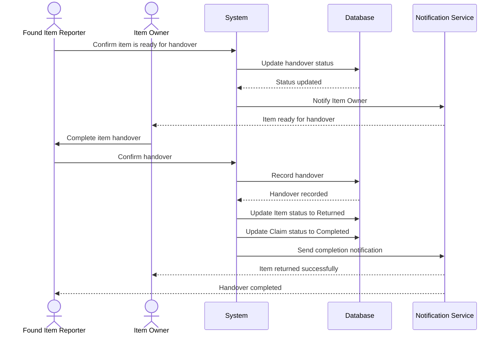
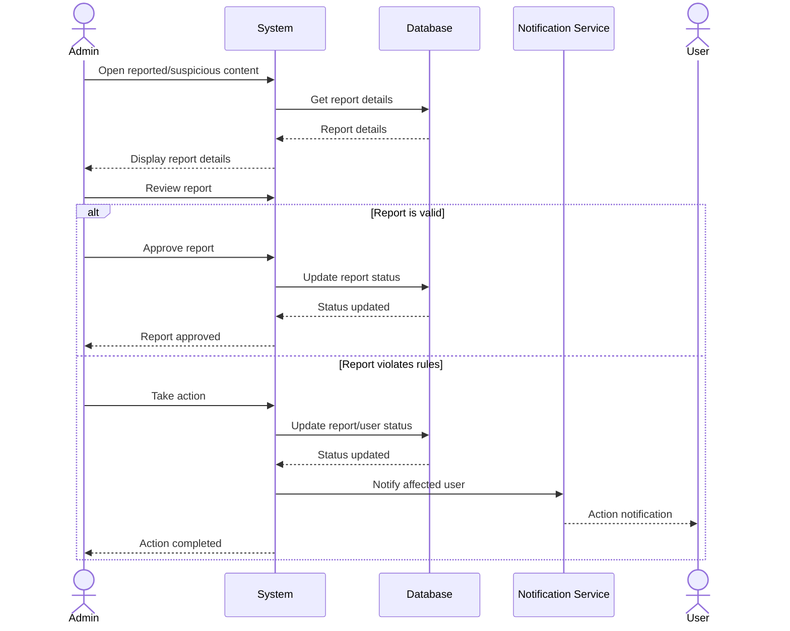
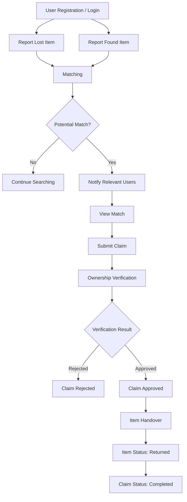

````markdown
# Lost & Found Platform — Sequence Diagrams

This document describes the main interactions between users and the Lost & Found Platform.

The diagrams focus on the main business flows of the system.

---

## 1. User Registration & Login

```mermaid
sequenceDiagram
    actor User
    participant System
    participant Database

    User->>System: Register
    System->>Database: Check if email already exists

    alt Email already exists
        Database-->>System: Email exists
        System-->>User: Registration failed
    else Email available
        Database-->>System: Email available
        System->>Database: Create user account
        Database-->>System: User created
        System-->>User: Registration successful
    end

    User->>System: Login
    System->>Database: Validate credentials

    alt Valid credentials
        Database-->>System: Credentials valid
        System-->>User: Login successful
    else Invalid credentials
        Database-->>System: Credentials invalid
        System-->>User: Login failed
    end
````

---

## 2. Create Lost Item Report

```mermaid
sequenceDiagram
    actor User
    participant System
    participant Database
    participant Matching as Matching Service
    participant Notification as Notification Service

    User->>System: Submit Lost Item Report

    System->>System: Validate report data

    alt Invalid data
        System-->>User: Validation errors
    else Valid data
        System->>Database: Save Lost Report
        Database-->>System: Report created

        System->>Matching: Check for potential matches
        Matching-->>System: Matching results

        alt Potential match found
            System->>Notification: Notify relevant user(s)
            Notification-->>User: Match notification
        else No match found
            System-->>User: Report created successfully
        end
    end
```

---

## 3. Create Found Item Report



---

## 4. Search & Browse Reports



---

## 5. Matching Lost & Found Items



---

## 6. Submit Claim & Ownership Verification



---

## 7. Item Handover & Claim Completion



---

## 8. Admin Reviews a Report



---

## Main Business Flow

The overall platform flow can be summarized as:



---

## Main Entities Involved

The main business entities involved in these flows are:

* User
* LostReport
* FoundReport
* Category
* Match
* Claim
* OwnershipVerification
* Handover
* Notification

---

## Main Actors

### User

A registered user can:

* Report lost items
* Report found items
* Search and browse reports
* View potential matches
* Submit claims
* Complete ownership verification
* Track report and claim status
* Receive notifications

### Admin

An admin can:

* Manage users
* Review lost/found reports
* Review claims
* Review reported or suspicious content
* Take appropriate actions

